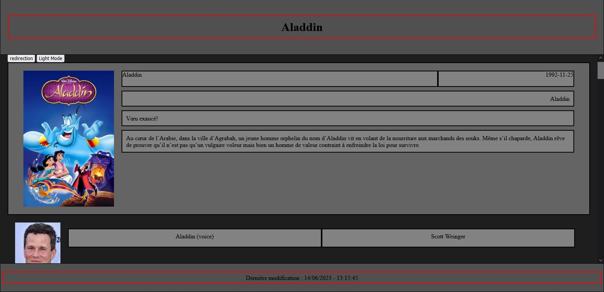

# SAE 2.01 - Développement d'une application

# Auteurs
BONNEVIE Dylan : bonn0104 - dylan.bonnevie@etudiant.univ-reims.fr  
SIMON Baptiste : simo0170 - baptiste.simon@etudiant.univ-reims.fr

## Mise en place du projet
Installation et configuration de Composer
Ajout des classes MyPdo, WebPage et AppWebPage
Protection de la branche principale **main**

# Arborescence du projet

# Classes utilisées dans le code PHP 

## **MyPdo**

Une classe qui représente une connexion PDO à la base de données. Elle implémente le design pattern Singleton 
pour assurer qu'il n'y a qu'une seule instance de connexion active à la base de données.
Méthodes

### Méthodes  
    getInstance(): MyPdo: Retourne l'instance unique de la classe MyPdo.
    prepare(string $query): PDOStatement: Prépare une requête SQL en utilisant la connexion PDO.
    execute(array $params): bool: Exécute une requête préparée avec des paramètres.
    fetchAll(int $fetchStyle): array: Récupère toutes les lignes de résultat d'une requête sous forme de tableau.

## **WebPage**

La classe WebPage représente une page web avec ses éléments de base tels que la balise <head> et la balise <body>.
### Propriétés

    private string $head: Contient le contenu de la balise <head> de la page.
    private string $title: Contient le titre de la page.
    private string $body: Contient le contenu de la balise <body> de la page.

### Méthodes

    __construct(string $title = ""): Constructeur de la classe. Permet d'initialiser la propriété $title de la page.
    getHead(): string: Retourne le contenu de la balise <head> de la page.
    getTitle(): string: Retourne le titre de la page.
    setTitle(string $title): void: Modifie le titre de la page.
    getBody(): string: Retourne le contenu de la balise <body> de la page.
    appendToHead(string $content): void: Ajoute du contenu à la balise <head> de la page.
    appendCss(string $css): void: Ajoute du contenu CSS à la balise <head> de la page.
    appendCssUrl(string $url): void: Ajoute l'URL d'un fichier CSS à la balise <head> de la page.
    appendJs(string $js): void: Ajoute du contenu JavaScript à la balise <head> de la page.
    appendJsUrl(string $url): void: Ajoute l'URL d'un fichier JavaScript à la balise <head> de la page.
    appendContent(string $content): void: Ajoute du contenu à la balise <body> de la page.
    toHTML(): string: Génère la représentation HTML complète de la page.
    getLastModification(): string: Récupère la date et l'heure de la dernière modification du script principal.
    escapeString(string $string): string: Protège les caractères spéciaux pouvant dégrader la page Web.

## **AppWebPage**

Une classe qui représente une page web.
### Propriétés

    title: string: Le titre de la page.
    cssUrls: array: Les URLs des fichiers CSS à inclure dans la page.
    content: string: Le contenu HTML de la page.

### Méthodes

    setTitle(string $title): void: Définit le titre de la page.
    appendCssUrl(string $cssUrl): void: Ajoute l'URL d'un fichier CSS à inclure dans la page.
    appendContent(string $content): void: Ajoute du contenu HTML à la page.
    toHtml(): string: Génère le code HTML complet de la page.

## **People**

Une classe qui représente une personne, telle qu'un acteur ou un réalisateur, dans le contexte des films.
### Propriétés

    id: int: L'ID unique de la personne.
    name: string: Le nom de la personne.
    placeOfBirth: string: Le lieu de naissance de la personne.
    birthday: string: La date de naissance de la personne.
    deathday: string|null: La date de décès de la personne, ou null si elle est toujours en vie.
    biography: string: La biographie de la personne.
    avatarId: int|null: L'ID de l'image représentant la personne, ou null s'il n'y a pas d'image disponible.

### Méthodes

    getId(): int: Retourne l'ID de la personne.
    getName(): string: Retourne le nom de la personne.
    getPlaceOfBirth(): string: Retourne le lieu de naissance de la personne.
    getBirthday(): string: Retourne la date de naissance de la personne.
    getDeathday(): string|null: Retourne la date de décès de la personne, ou null si elle est toujours en vie.
    getBiography(): string: Retourne la biographie de la personne.
    getAvatarId(): int|null: Retourne l'ID de l'image représentant la personne, ou null s'il n'y a pas d'image disponible.

## **PeopleCollection**

La classe PeopleCollection est responsable de la gestion et de la manipulation d'une collection de personnes dans le contexte des films.
### Méthodes

    findByMovieId(int $movieId): array: Récupère toutes les personnes qui ont joué un rôle dans un film spécifique.
        Paramètres:
            $movieId (int): L'ID du film.
        Retourne:
            array: Un tableau contenant toutes les personnes ayant un rôle dans le film.

    findAll(): array: Récupère toutes les personnes disponibles dans la base de données.
        Retourne:
            array: Un tableau contenant toutes les personnes.

    findById(int $id): People: Recherche une personne par son ID.
        Paramètres:
            $id (int): L'ID de la personne.
        Retourne:
            People: L'objet People correspondant à l'ID spécifié.

## **Movie**

La classe Movie représente un film.
### Propriétés

    id (int): L'ID du film.
    posterId (int|null): L'ID du poster du film.
    originalLanguage (string): La langue originale du film.
    originalTitle (string): Le titre original du film.
    overview (string): Le résumé du film.
    releaseDate (string): La date de sortie du film.
    runtime (int): La durée du film en minutes.
    tagline (string): Le slogan du film.
    title (string): Le titre du film.

### Méthodes

    getId(): int: Renvoie l'ID du film.
    getOriginalLanguage(): string: Renvoie la langue originale du film.
    getOriginalTitle(): string: Renvoie le titre original du film.
    getOverview(): string: Renvoie le résumé du film.
    getReleasedate(): string: Renvoie la date de sortie du film.
    getRuntime(): int: Renvoie la durée du film en minutes.
    getTagline(): string: Renvoie le slogan du film.
    getTitle(): string: Renvoie le titre du film.
    getPosterId(): ?int: Renvoie l'ID du poster du film.

## **MovieCollection**
La classe MovieCollection est une collection de méthodes permettant de récupérer des films à partir de la base de données.
### Méthodes

    findAll(): array: Cette méthode permet de trouver tous les films disponibles dans la base de données.
        Retourne : Un tableau contenant tous les films triés par titre.

    findByPeopleId(int $peopleId): array: Cette méthode permet de trouver tous les films dans lesquels une personne spécifique a joué un rôle.
        Paramètres :
            int $peopleId : L'ID de la personne.
        Retourne : Un tableau contenant tous les films dans lesquels la personne a joué un rôle, avec le rôle correspondant dans chaque film.

    findByGenreName(string $name): array: Cette méthode permet de trouver tous les films d'un genre spécifique.
        Paramètres :
            string $name : Le nom du genre.
        Retourne : Un tableau contenant tous les films du genre spécifié.

## **Image**

Une classe qui représente une image.
### Propriétés

    id: int: L'ID unique de l'image.
    path: string: Le chemin vers le fichier de l'image.

### Méthodes

    getId(): int: Retourne l'ID de l'image.
    getPath(): string: Retourne le chemin vers le fichier de l'image.
    getJpeg(): string: Retourne le contenu de l'image au format JPEG.

## **ImageCollection**

Une classe qui représente une collection d'images.
### Méthodes

    findById(int $id): Image|null: Recherche une image par son ID et retourne l'objet Image correspondant, 
    ou null si aucune image n'est trouvée.

## **Genre**

La classe Genre représente un genre de film.
### Propriétés

    id (int): L'ID du genre.
    name (string): Le nom du genre.

### Méthodes

    getId(): int: Renvoie l'ID du genre.
    getName(): string: Renvoie le nom du genre.

## **GenreCollection**

La classe GenreCollection est une collection de genres de films.
### Méthodes

    findByMovieId(int $movieId): array: Cette méthode permet de trouver tous les genres d'un film en fonction de son ID. 
    Elle renvoie un tableau contenant tous les genres du film.

    findAll(): array: Cette méthode permet de trouver tous les genres de films disponibles dans la base de données. 
    Elle renvoie un tableau contenant tous les genres.

## **Cast**

La classe Cast représente un casting pour un film, associant un acteur à un rôle dans le film.
### Propriétés

    id (int): L'ID du casting.
    movieid (int): L'ID du film.
    peopleId (int): L'ID de l'acteur.
    role (string): Le rôle de l'acteur dans le film.
    orderIndex (int): L'index de l'ordre du casting.

### Méthodes

    getId(): int: Cette méthode retourne l'ID du casting.
    getMovieid(): int: Cette méthode retourne l'ID du film associé au casting.
    getPeopleId(): int: Cette méthode retourne l'ID de l'acteur associé au casting.
    getRole(): string: Cette méthode retourne le rôle de l'acteur dans le film.
    getOrderIndex(): int: Cette méthode retourne l'index de l'ordre du casting.

## **CastCollection**

La classe CastCollection est une collection de castings associés à des films.
### Méthodes

    findByMovieIdAndPeopleId(int $movieId, int $peopleId): Cast: Cette méthode permet de rechercher le casting 
    d'une personne dans un film spécifique en utilisant l'ID du film et l'ID de la personne.
    Elle renvoie l'objet Cast correspondant au casting trouvé.

# **Les pages Web**

## **index.php**
    Cette page Web affiche une liste de films avec des filtres par genre. 
    Les films sont récupérés à partir d'une base de données et affichés avec leur titre et leur image associée. 
    Les utilisateurs peuvent sélectionner les genres de films qu'ils souhaitent voir à l'aide de cases à cocher. 
    Lorsque les genres sont soumis, la liste de films est mise à jour en conséquence.

### Le rendu de la page en Dark Mode

### Le rendu de la page en Light Mode

## **Movie.php**
    Cette page affiche les détails d'un film spécifique, y compris son titre, sa date de sortie, 
    son synopsis et les acteurs qui y ont participé. 

    Les informations sont récupérées à partir d'une base de données et affichées de manière structurée. 
    Les utilisateurs ont également la possibilité de naviguer vers d'autres pages, 
    telles que le menu principal, la création d'un nouveau film, la suppression ou la modification du film actuel.

### Le rendu de la page en Dark Mode

### Le rendu de la page en Light Mode

## **people.php**
    Cette page affiche les détails d'une personne, telle qu'un acteur ou une actrice, 
    y compris son nom, sa date de naissance, sa biographie et les films dans lesquels elle a joué.

    Les informations sont récupérées à partir d'une base de données et affichées de manière structurée. 
    Les utilisateurs ont également la possibilité de naviguer vers d'autres pages, comme le menu principal et la création d'un nouveau film.

### Le rendu de la page en Dark Mode

### Le rendu de la page en Light Mode

## **form.php**
    Cette page permet de créer, éditer ou supprimer des films. L'utilisateur peut accéder à ces fonctionnalités via des liens de redirection. 
    Lors de la création d'un nouveau film, un formulaire est affiché avec différents champs tels que le titre, la date de sortie, le résumé, etc. 
    Une fois le formulaire soumis, les données sont insérées dans la base de données. 
    Lors de l'édition d'un film existant, un formulaire pré-rempli avec les informations actuelles du film est affiché, et l'utilisateur peut modifier les champs souhaités. 
    Enfin, lors de la suppression d'un film, les données correspondantes sont supprimées de la base de données.

### Le rendu de la page du formulaire d'ajout

# **JavaScript**
Ce repertoire contenu dans le repertoire **public**, contient les fichier script JavaScript, pour chaque bouton Light Mode / Dark Mode

### Light_Dark_mode.js
    Cette script s'occupe d'éclaicir la background-color des différents éléments 
    de la page index.php 

### Light_Mode_movie.js
    Cette script s'occupe d'éclaicir la background-color des différents éléments 
    de la page movie.php 

### Light_Mode_people.js
    Cette script s'occupe d'éclaicir la background-color des différents éléments 
    de la page people.php 
